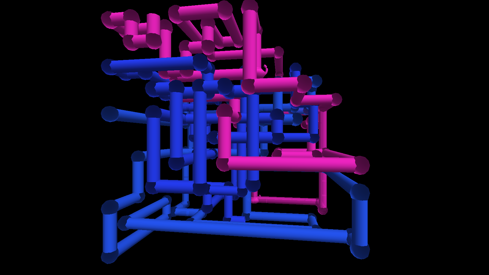

# idler user guide

idler is **the Windows 95/98 screensaver suite, rebuilt as a generator** for
[Resolume](https://resolume.com) Arena and Avenue — eleven savers in one plugin, and again as an
OpenFX plugin for Resolve, Nuke and Natron.

| | |
|---|---|
| **Mystify** | Bouncing polygons trailing their own history |
| **Beziers** | The same motion, drawn as curves |
| **Curves and Colors** | A spirograph drawing itself on a rotating palette |
| **Flying Windows** | The four-pane logo streaming out of the screen |
| **Flying Through Space** | The starfield |
| **Scrolling Marquee** | A text banner crossing the frame |
| **3D Maze** | A first-person walk down brick corridors |
| **3D Pipes** | Plumbing growing into a box, teapots and all |
| **3D Flying Objects** | Lit solids tumbling past |
| **3D FlowerBox** | A polyhedron morphing on the spot |
| **3D Text** | Extruded lettering, turning |

> **Before you rely on this:** every saver is verified by a harness that drives the real plugin
> class in a headless GL context — the mesh each one builds (triangle counts, bounding boxes,
> indices in range, every normal unit length), that all eleven draw at five different times
> including zero, and 64 control/context pairs with none dead. For the two savers that *grow*, a
> frame reached by replaying the clock is **byte-identical** to the same frame rendered cold.
>
> **Both plugins have been loaded into Resolume and run, and all eleven savers render there.**
> Still untested: bar sync against a real transport, how the parameter groups land in the
> inspector, Windows (built, never run), and the OpenFX build in a real OFX host. It has never
> been used on a live show.
>
> This codebase was created with AI assistance, directed and reviewed by a human author.

---

## Installing

Drop both plugins into `~/Documents/Resolume Arena/Extra Effects` (or the Avenue equivalent) and
restart Resolume. macOS builds are signed and notarised; the Windows builds are unsigned, but only
the installer trips SmartScreen.

**Idler** is a source. **Idler Mask** is an effect that draws the saver over the incoming clip —
or reveals, hides or tints the clip *through* it.

### OpenFX hosts

Copy `Idler.ofx.bundle` into `/Library/OFX/Plugins`. A generator and a matching filter are both in
the one bundle. An OFX host hands a plugin a buffer rather than a GL context, so that build
rasterises in software; the savers themselves are the same code, and the two renderers are checked
against each other. Sync there offers **Free and Manual only**, because OFX carries no tempo —
Phase is the thing to keyframe.

---

## Start from a preset, not from the dropdown

**The first eleven presets are each saver set up the way it actually ran.** Picking a saver from
the dropdown alone gives you that saver driven by whatever the sliders happen to say, which is
often not what it looked like on the machine.

This is not a nicety, it is how the plugin is shaped — see the next section. The remaining presets
are looks that were never on anybody's monitor: a wireframe maze over transparency, a hyperspace
starfield, pipes as a tinted overlay.

---

## Seven sliders, eleven savers

Every saver shares **one** parameter list: seven deliberately generic scene controls — **Density,
Complexity, Size, Length, Line Width, Variation, Shading** — each mapped by each saver to whatever
it has that is analogous.

**Density** is Mystify's polygon count, the starfield's star count, and the number of pipes
growing at once. It is genuinely a different quantity in each, and that is the trade: the
alternative was about ninety parameters of which roughly eighty-two are dead at any moment, plus a
saved composition that renumbers itself whenever a saver is added.

Two consequences to expect:

- **A preset built for one saver rarely reads well on another.** Move between savers by moving
  between presets.
- **Most controls are dead most of the time, by design.** Fog does nothing in Mystify, which has
  no depth; Line Width nothing in FlowerBox, which has no lines; Text nothing in nine of the
  eleven. A control that appears to do nothing is usually a control that does nothing *on this
  saver*.

**Colour Mode is the other one worth finding.** *Classic* is each saver's own palette as it was.
*Tint*, *Spread* and *Cycle* put the whole suite under one colour scheme, which is what makes any
of it usable behind a band.

---

## Why it cannot drift

Every saver is a **pure function of (time, seed)**. Nothing integrates a velocity, and nothing
remembers the previous frame.

That is not a purist's flourish — it is what makes the plugin usable in a show:

- **It cannot drift.** Resolume's frame rate drops when the show gets heavy. A saver that slowed
  down under load would come apart from the music.
- **Beat sync is free.** Time is just a number, so handing it the host's bar position locks the
  animation with no second code path.
- **Phase is scrubbable and keyframable.** Drag it and the picture goes where you dragged it —
  including for 3D Pipes, where the network grows to wherever you put the slider.

The two savers that genuinely grow — **Pipes** and **Maze** — get there by deterministic replay
from the seed, so the same composition builds the same pipe network on the show laptop and on the
rack machine.

---

## Using Idler Mask

The effect variant is the one that earns its place in a real show. Rather than putting a saver on
its own layer and choosing a blend mode, it draws the saver over the clip with the controls on the
clip — and the Mask/Mix pair lets the saver *reveal*, *hide* or *tint* the footage instead of
merely sitting on top of it.

A wireframe maze used as a mask over a camera feed is a different thing from a wireframe maze over
black, and it costs no extra layer.

---

## If it looks wrong

**I picked a saver and it looks nothing like I remember.** Pick its **preset** instead. See above.

**A slider does nothing.** It is probably not live on this saver. Fog needs depth; Line Width
needs lines; Text needs one of the two savers that draw any.

**The animation slows down when the show gets heavy.** It should not — nothing here integrates per
frame. If you see it, that is a bug worth reporting.

**3D Pipes builds a different network on the other machine.** Check the **Seed** travelled with
the composition. Replay is deterministic from the seed and nothing else.

---

## Not affiliated with Microsoft

This is an original implementation of screensavers everybody remembers. No Microsoft code, artwork
or assets are used or included. The Flying Windows logo is a four-quad gesture toward the mark
rather than a reproduction of it, and 3D Pipes' teapot is generated from a profile curve rather
than being Newell's dataset.
